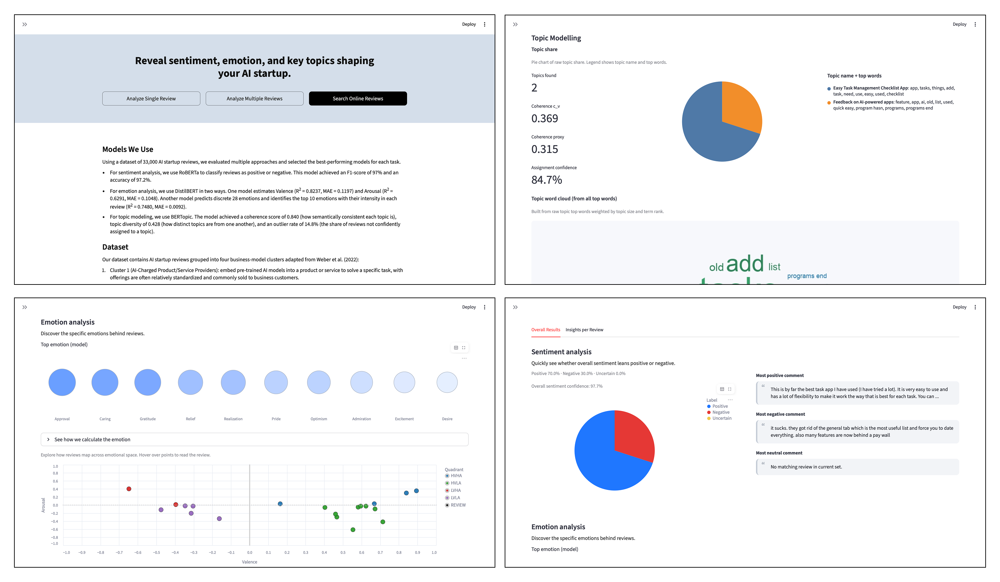

# AI Startup Review Insights Dashboard

A Streamlit dashboard for analyzing AI startup reviews across sentiment, emotion, and topics.
- **Sentiment**: Positive / Negative (with confidence)
- **Emotion**: Discrete top emotions with intensity, plus valence/arousal signals and summary statistics.
- **Topic Modeling**: Theme discovery, keywords, and LLM-generated topic labels/summaries



## Repository Structure

```text
dashboard/
├── app.py                         # Home page entrypoint
├── pages/
│   ├── 1_Analyze_Single_Review.py
│   ├── 2_Analyze_Multiple_Reviews.py
│   ├── 3_Search_Online_Reviews.py
│   └── page3/                     # Modular implementation for Search Online Reviews
├── helpers/                       # UI renderers, shared pipelines, validation, sidebar nav
├── inference/
│   ├── topic/                     # Topic discovery, keywords, LLM topic label/summary
│   ├── emotion/                   # Discrete emotion + valence/arousal
│   └── sentiment/                 # Sentiment classifier
├── fetchers/                      # Platform fetch/search adapters (Google Play, iOS, G2, Trustpilot)
├── artifacts/                     # Local model artifacts
├── dataset/
└── lexicon/
```

## Quickstart

- **Prerequisites**: Python 3.10+, `pip`
- **Setup**: create and activate a virtual environment, then run `pip install -r requirements.txt`
- **Environment**: create `.env` and set `GROQ_API_KEY=<your_key>`
- **Run**: `streamlit run app.py`
